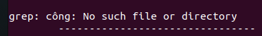
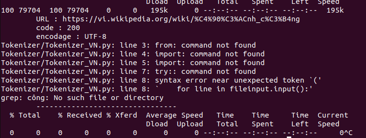
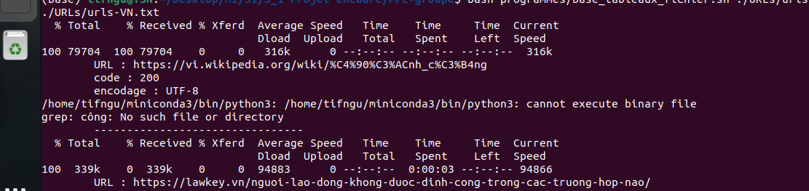
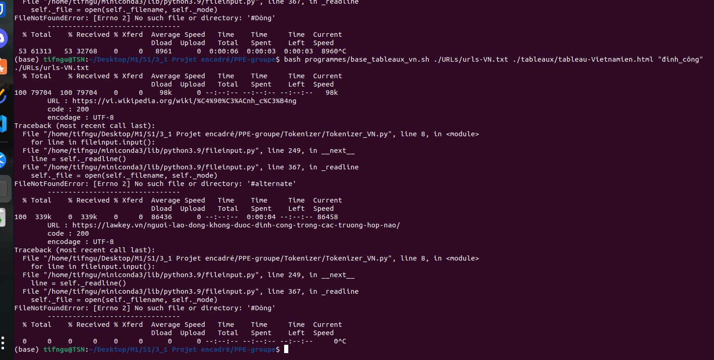
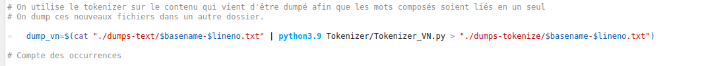

# Journal de bord du projet encadré.


## 30 sept 2022.

### Exercices git-intro

Ajout de journal-de-bord.md via le dépôt puis répercuter les changements avec 
`$ git pull` ou
`$ git fetch`

Modification du journal de bord via l'éditeur de texte et pour synchroniser vers le dépôt il faudra ensuite
```
$ git add 
$ git commit
$ git push
```
**Remarque : il faut un token parce que le _password authentification_ a été enlévé.**

Ajout du Markdown cheat sheet pour pouvoir le retrouver plus facilement.

---

## 05 oct 2022.

Composition du groupe : Amina, Yaasmine, Tifanny (moi-même).

Langues : Anglais, Vietnamien et Créole Mauricien.

Clé : `$ cat ~/.ssh/id_ed25519.pub`

Tag : `$ git tag NOM -a -m MESSAGE`

### Exercices git-II

Commande pour récupérer ID SHA `$ git log`.

Défaire le commit avec `$ git revert <SHA>`. Beaucoup de pbs avec cette commande : "unmerged path files". Je n'ai pas trouvé la solution au problème, il faut supprimer les ajouts à la main(??)

---

## 12 oct 2022.

Ajout du premier script.sh dans le dépôt.

J'ai aussi reclôné le git dans mon pc avec la clé SSH afin de pouvoir y accéder sans token.

---

## 19 oct 2022.

Absente.
J'ai rattrapé les cours (cURL)

---

## 09 nov 2022.

Ajout d'une page index.html sur le site et démarrage d'un site web et essai d'ajout d'un lien vers une autre page html nommée "Tableaux".

### Exercice - Validation et construction du corpus depuis un URL.

1 - Ajout d'un programme "if"

2 - curl -I url pour récupérer les entêtes

---

## 11 janvier 2022.

Je n'ai pas eu le temps de tenir le journal de bord.

### Résumé :

Nous avons choisi le mot "grève" ainsi que les trois langues suivantes : Vietnamien, français et anglais. Nous avons délaissé le créole mauricien pour pouvoir avoir le français et plus de sources.

J'ai eu plusieurs problèmes au cours de ce travail :
1 - Trouver 50 urls a été assez difficile pour ma part : les articles disponibles pour la France sont surtout des articles de sites de loi et des copiés collés entre eux. Il est difficile de trouver un article journalistique comme pour le contenu français.
2 - Après avoir réussi à trouver 50 urls, puisque plusieurs sites ne nous laissent pas accéder aux informations demandées via le script. Ils bloquent l'accès et rendent impossible l'extraction du contenu.
3 - Le début du tableau était ok jusqu'à ce qu'on ajoute la variable "mot" afin de pouvoir récupérer le mot voulu.
En vietnamien, le mot grève se traduit par "đình công". Le problème : l'espace entre les deux mots qui n'est pas compris pas grep.



Cette erreur peut être résolue par un tokenizer en python, que les profs ont fourni dans le git du cours.
C'était donc parti pour le faire fonctionner...
... Pas facile.

4 - Dans un script à part pour ne pas déranger mes camarades, j'ai essayé d'exécuter le token. En fonction de la ligne à laquelle je plaçais dans le script "ython3.9 Tokenizer_VN.py", j'avais une erreur différente. Voici les trois erreurs qui revenaient le plus souvent :







Malgré quelques mails, je n'ai pas réussi à régler le problème mais heureusement, Mr. MAGISTRY est un génie. La solution était la suivante :



Cette solution m'a permis de voir que beaucoup de mes URLs devaient être remplacées... et après 1 heure..2 heures...3 voire 4 heures...
...
J'ai enfin réussi à trouver 50 URLs potables.

### Le groupe a enfin pu faire un site présentable et finir ce projet...vivant.

Avec le retard pris à cause du tableau, les filles avaient déjà commencé un site. J'ai fourni un code template pour qu'il ressemble plus à un journal et je suis passée derrière pour attraper les fautes, les corriger et aider à régler certains problèmes rencontrés.
Je me suis occupée du début de la page d'accueil ainsi que de la partie "Contexte au Vietnam", des descriptions pour le script du tableau vietnamien et celui des concordances, la page à propos ainsi que certains éléments de mise en page un peu partout.

J'ai plus travaillé la nuit pour pouvoir corriger sans casser le travail des filles.

Après une nuit blanche, ou deux, nous avons enfin fini.
